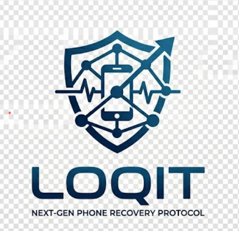

# <div align="center">LOQIT: Next-Gen Phone Recovery Protocol</div>

<div align="center">
  
</div>

<div align="center">


</div>

<p align="center">
  <b>LOQIT</b> is an enterprise-grade, end-to-end device recovery ecosystem designed to revolutionize how stolen and lost phones are tracked, identified, and recovered in India.
</p>

---

## 🚀 The LOQIT Advantage

Traditional phone recovery is broken. **LOQIT** fixes it by unifying the community and law enforcement into a single, high-speed mesh network.

- **Passive Mesh Tracking**: Every phone with the LOQIT app acts as a silent probe, passively scanning for "Lost" signals via BLE—even without an active internet connection on the target device.
- **Police Intelligence Terminal**: A dedicated web command center for officers featuring **AI-driven risk scoring** to prioritize cases and suspicious activity.
- **Hyper-Secure Verification**: Integrated **Aadhaar verification** and IMEI cross-referencing ensure that only true owners can claim devices.
- **Universal Auth**: Seamless onboarding via **Google OAuth**, **SMS OTP (Twilio)**, or traditional Email.

---

## 🛠 Tech Stack

### Frontend & Mobile
- **Mobile**: Expo SDK 55 + React Native (Universal App)
- **Web Portal**: Vite 5 + React 18 (Premium Dashboard)
- **Styling**: Theme-aware CSS Variables for native Light/Dark performance.
- **Animations**: Framer Motion (Web) & Reanimated (Mobile).

### Backend Engineering
- **Engine**: Supabase (Postgres + RLS + Realtime).
- **Edge**: Deno-based Supabase Functions for cryptographic key generation.
- **AI**: Groq-powered Intelligence Analyzer for police analytics.
- **Communications**: Twilio SMS integration for high-priority alerts.

---

## 📁 System Architecture

### 1. The Civilian Experience (Mobile + Web)
- **Register**: Link devices via IMEI/Serial with Aadhaar-backed ownership.
- **Report**: Mark a device as "Lost" or "Stolen" to trigger the global BLE mesh.
- **Chat**: Anonymous, end-to-end coordinated chat between finders and owners.
- **Adaptive UI**: Switch between a sleek Cyber-Dark or Crystal-Light theme.

### 2. The Finder Workflow (Mobile)
- **Passive Scan**: App runs in the background, matching nearby BLE beacons against the LOQIT global directory.
- **Instant Ping**: When a match is found, the owner is notified with a last-known GPS snapshot.

### 3. The Police Terminal (Web Exclusive)
- **Operational Map**: Density maps of lost vs. recovered devices.
- **Case Management**: Assign officers to reports and track recovery progress.
- **AI Analytics**: Intelligent scoring of chat logs and report descriptions to detect fraud or high-value targets.

---

## ⚙️ Setup & Installation

### Prerequisites
- Node.js 18+
- Supabase Project
- Twilio Account (for SMS Auth)
- Google Cloud Project (for OAuth)

### 1. Clone & Install
```bash
git clone https://github.com/zore1803/LOQIT.git
cd LOQIT
npm install
cd web && npm install && cd ..
```

### 2. Environment Configuration
Create a `.env` in the root and `web/.env`. Fill in your Supabase credentials, Twilio SIDs, and Google Client IDs.

### 3. Launch Development
**Web Portal:**
```bash
cd web
npm run dev
```

**Mobile App:**
```bash
npm run android
```

---

## 🔐 Security & RLS
LOQIT enforces a "Privacy First" policy:
- **Masked Ownership**: IMEI lookups only reveal masked names (e.g., `J**** D**`).
- **Tokenized Chats**: Room access is granted via single-use finder tokens.
- **Strict RLS**: All database paths are protected by row-level security policies.

---

## 📜 License
© 2026 LOQIT. All Rights Reserved. Developing for a more secure digital India.
